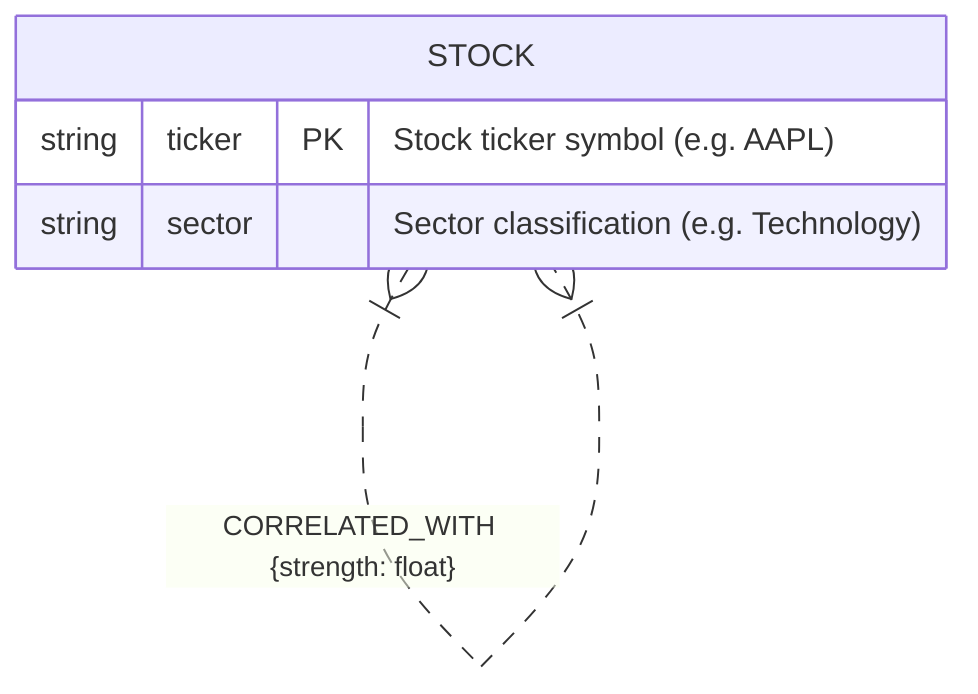
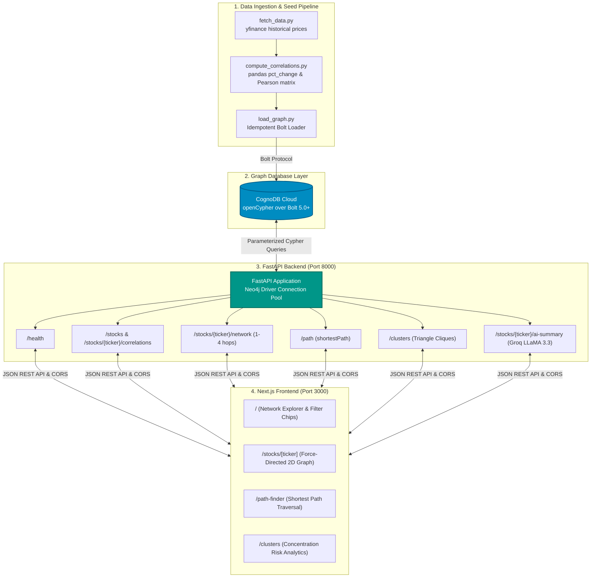
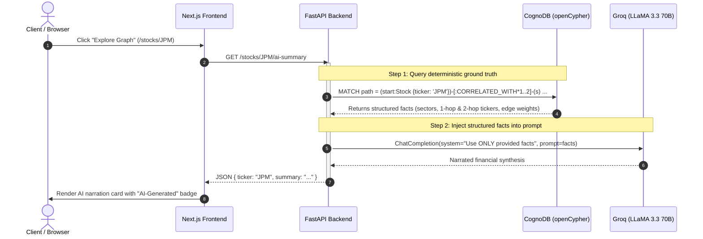
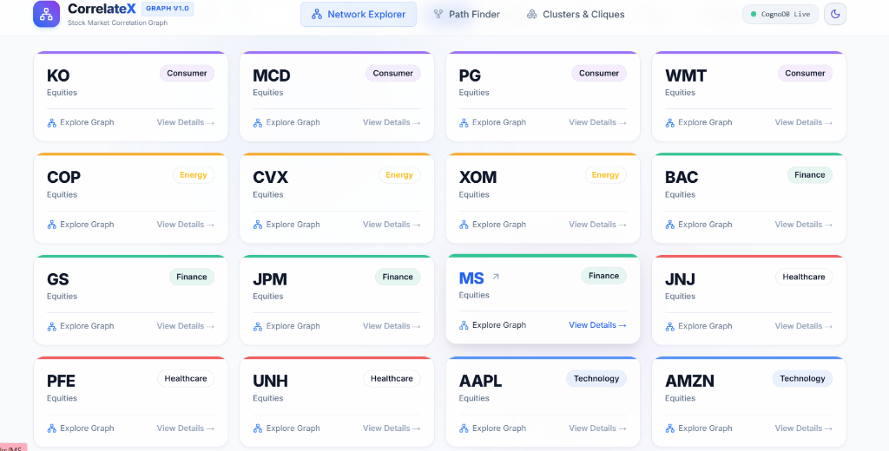
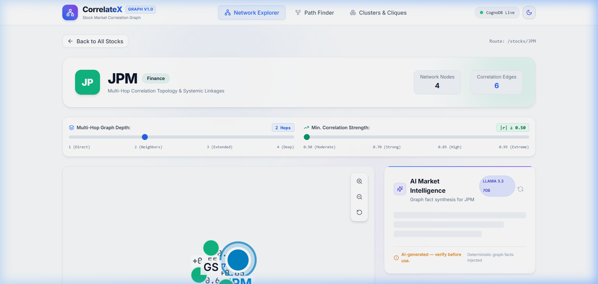
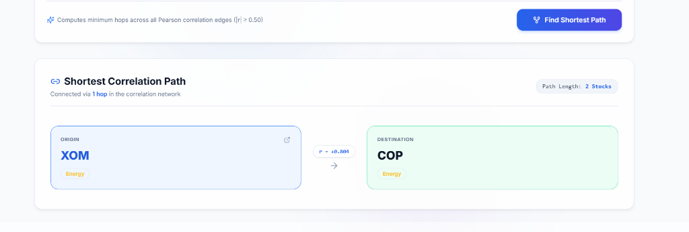
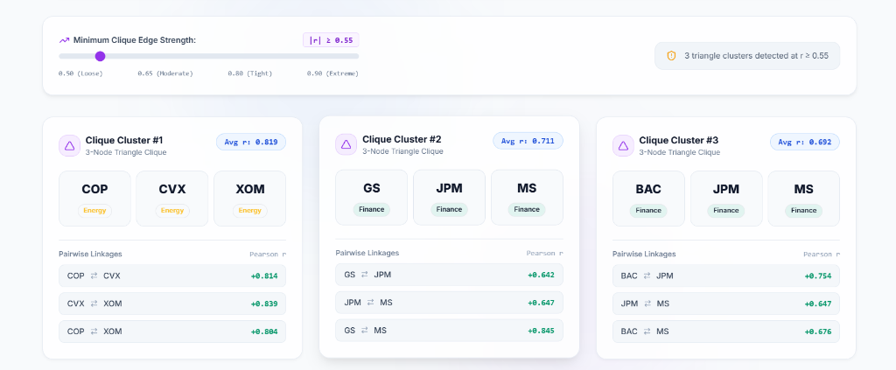

# CorrelateX : Stock Market Correlation Graph Engine

**A graph-native financial intelligence platform modeling equity co-movements as a multi-hop graph to discover hidden systemic risks, contagion paths, and triangle cliques.**

[](https://www.python.org/downloads/)
[](https://fastapi.tiangolo.com)
[](https://nextjs.org/)
[-008CC1.svg)](https://cognodb.com)
[](https://groq.com)
[](https://opensource.org/licenses/MIT)

**Tech Stack:** `CognoDB` • `openCypher` • `Neo4j Python Driver` • `FastAPI` • `Next.js (App Router)` • `TypeScript` • `Groq LLaMA 3.3` • `Tailwind CSS` • `pandas` • `yfinance`

🌐 **Live Demo:** [https://correlatex.vercel.app](https://correlatex.vercel.app) *(or your deployed Vercel link)*  
Backend API: [https://correlatex-api.onrender.com](https://correlatex-api.onrender.com)

---

## Table of Contents
1. [What is CorrelateX?](#1-what-is-correlatex)
2. [Why a Graph Database?](#2-why-a-graph-database)
3. [Data Model](#3-data-model)
4. [Architecture Overview](#4-architecture-overview)
5. [AI Narrative Synthesis Flow](#5-ai-narrative-synthesis-flow)
6. [Key Cypher Queries Explained](#6-key-cypher-queries-explained)
7. [Setup & Installation Instructions](#7-setup--installation-instructions)
8. [Testing the API](#8-testing-the-api)
9. [API Reference](#9-api-reference)
10. [Application UI Screenshots](#10-application-ui-screenshots)
11. [Design Decisions & Tradeoffs](#11-design-decisions--tradeoffs)
12. [Known Limitations & Future Work](#12-known-limitations--future-work)
13. [License](#license)

---

## ⚡ Quick Start (TL;DR)

```bash
# 1. Clone repo & navigate
git clone https://github.com/TechySan031/CorrelateX.git && cd CorrelateX

# 2. Configure environment (add CognoDB & Groq credentials to backend/.env)
cp backend/.env.example backend/.env && cp frontend/.env.example frontend/.env.local

# 3. Seed CognoDB graph database with real market data
cd backend && pip install -r requirements.txt && python run_seed.py

# 4. Start FastAPI backend (http://localhost:8000)
uvicorn app.main:app --reload --port 8000

# 5. Start Next.js frontend (http://localhost:3000)
cd ../frontend && npm install && npm run dev
```

---

## 1. What is CorrelateX?

Modern financial markets are deeply interconnected. When analyzing risk, looking at individual stock metrics or simple correlation heatmaps fails to capture higher-order relationships such as:
- **Indirect Contagion:** If stock A correlates with B, and B correlates with C, how does a shock in A propagate to C?
- **Hidden Portfolio Concentration:** An investor holding 3 stocks across seemingly distinct sectors might actually hold a tightly-knit triangle clique where all 3 equities move synchronously.
- **Shortest Transmission Paths:** What is the shortest chain of price dependency connecting a mega-cap tech company to an energy major?

CorrelateX calculates daily percentage return correlations using `yfinance` and `pandas`, loads the network into CognoDB as weighted undirected relationships, and exposes an exploratory UI with force-directed graphs, dynamic hop exploration, shortest-path calculation, dark/light mode, and AI narrative generation via **Groq (LLaMA 3.3 70B)**.

---

## 2. Why a Graph Database?

Correlation is inherently **relational and multi-hop** — the most valuable market insights lie in traversals, paths, and subgraphs, not isolated records.

### Why Relational Databases (SQL) Struggle with Graph Traversals
In a relational database, finding a 2-hop or 3-hop relationship requires multiple recursive self-joins or complex Recursive Common Table Expressions (`WITH RECURSIVE`).

```sql
-- SQL: Finding stocks within 2 hops of AAPL with correlation >= 0.5
WITH RECURSIVE CorrelationPath AS (
    SELECT ticker_a, ticker_b, strength, 1 AS depth
    FROM correlations
    WHERE (ticker_a = 'AAPL' OR ticker_b = 'AAPL') AND strength >= 0.5
    
    UNION
    
    SELECT c.ticker_a, c.ticker_b, c.strength, cp.depth + 1
    FROM correlations c
    JOIN CorrelationPath cp ON (c.ticker_a = cp.ticker_b OR c.ticker_b = cp.ticker_a)
    WHERE cp.depth < 2 AND c.strength >= 0.5
)
SELECT DISTINCT CASE WHEN ticker_a = 'AAPL' THEN ticker_b ELSE ticker_a END AS correlated_stock
FROM CorrelationPath;
```

**Problems with the SQL approach:**
1. **Exponential Performance Degradation:** Each recursive join performs Cartesian product scans, resulting in severe latency as hops exceed 2.
2. **Path Explosion & Loop Handling:** Cycle prevention in SQL requires tracking visited node arrays (`VARCHAR[]`), adding massive overhead.
3. **Shortest Path Computation:** SQL has no native `shortestPath()` algorithm — finding the shortest path requires writing a custom BFS algorithm inside stored procedures or recursive CTEs with guessing limits.

### Why openCypher / CognoDB Wins
In CognoDB, the same multi-hop traversal is a concise, declarative, native graph operation optimized by index-free adjacency:

```cypher
// openCypher: Finding stocks within 2 hops with minimum hop distance
MATCH (start:Stock {ticker: 'AAPL'})
MATCH path = (start)-[:CORRELATED_WITH*1..2]-(s:Stock)
WHERE ALL(r IN relationships(path) WHERE r.strength >= 0.5)
RETURN s.ticker, s.sector, min(length(path)) AS hops
ORDER BY hops, s.ticker;
```

---

## 3. Data Model

CorrelateX models equities as discrete nodes and Pearson correlation coefficients exceeding threshold $|r| \ge 0.50$ as weighted relationships.


> *Note on Relationship Directionality:* While `erDiagram` displays binary associations, `CORRELATED_WITH` represents a bidirectional (undirected) mathematical Pearson correlation ($r_{AB} = r_{BA}$). Canonical edge uniqueness is enforced at ingestion by sorting node pairs alphabetically before openCypher `MERGE`.

---

## 4. Architecture Overview



---

## 5. AI Narrative Synthesis Flow

To guarantee accuracy and eliminate LLM hallucination of financial market data, CorrelateX follows a strict **"Deterministic Facts First, AI Narration Second"** architecture:



---

## 6. Key Cypher Queries Explained

### 1. Fetch All Stocks
```cypher
MATCH (s:Stock)
RETURN s.ticker AS ticker, s.sector AS sector
ORDER BY s.sector, s.ticker
```
*Purpose:* Populates initial stock explorer directory and dropdown selectors.

---

### 2. Direct (1-Hop) Correlation
```cypher
MATCH (s:Stock {ticker: $ticker})-[r:CORRELATED_WITH]-(other:Stock)
WHERE r.strength >= $min_strength
RETURN other.ticker AS ticker, other.sector AS sector, r.strength AS strength
ORDER BY r.strength DESC
```
*Purpose:* Finds immediately coupled equities for the target stock.

---

### 3. Multi-Hop Network Traversal (2+ Hops)
```cypher
MATCH (start:Stock {ticker: $ticker})
MATCH path = (start)-[:CORRELATED_WITH*1..N]-(s:Stock)
WHERE s <> start
  AND ALL(r IN relationships(path) WHERE r.strength >= $min_strength)
WITH s.ticker AS ticker, s.sector AS sector, min(length(path)) AS hops
RETURN ticker, sector, hops
ORDER BY hops, ticker
```
*Design Note on Minimum Hop Distance:* Using `WITH s.ticker, s.sector, min(length(path)) AS hops` guarantees that if a stock is reachable via both a 1-hop and a 3-hop path, it appears **strictly once** in the returned network nodes at its shortest topological distance ($1$).
*Parameterization Note:* Variable-length relationship bounds (`*1..N`) cannot be parameterized in openCypher. The `hops` integer is strictly validated between 1 and 4 in the route handler before being interpolated.

---

### 4. Shortest Correlation Path (`shortestPath`)
```cypher
MATCH (a:Stock {ticker: $from_ticker}), (b:Stock {ticker: $to_ticker})
MATCH path = shortestPath((a)-[:CORRELATED_WITH*]-(b))
RETURN
  [n IN nodes(path) | {ticker: n.ticker, sector: n.sector}] AS path_nodes,
  [r IN relationships(path) | {
    source: startNode(r).ticker,
    target: endNode(r).ticker,
    strength: r.strength
  }] AS path_edges
```
*Why SQL finds this awkward:* Finding the shortest path in SQL requires either a BFS algorithm implemented in iterative procedural SQL or iterative recursive joins with cycle checking. In Cypher, `shortestPath()` evaluates natively via fast bidirectional graph traversal.

---

### 5. Triangle Cliques (Concentration Risk Clusters)
```cypher
MATCH (a:Stock)-[r1:CORRELATED_WITH]-(b:Stock)-[r2:CORRELATED_WITH]-(c:Stock)-[r3:CORRELATED_WITH]-(a)
WHERE a.ticker < b.ticker AND b.ticker < c.ticker
  AND r1.strength >= $min_strength
  AND r2.strength >= $min_strength
  AND r3.strength >= $min_strength
RETURN
  a.ticker AS ticker_a, a.sector AS sector_a,
  b.ticker AS ticker_b, b.sector AS sector_b,
  c.ticker AS ticker_c, c.sector AS sector_c,
  r1.strength AS strength_ab,
  r2.strength AS strength_bc,
  r3.strength AS strength_ac
ORDER BY (r1.strength + r2.strength + r3.strength) / 3.0 DESC
```
*Why `a.ticker < b.ticker AND b.ticker < c.ticker`:* Prevents returning 6 cyclic permutations of the exact same triangle.

---

## 7. Setup & Installation Instructions

### Step 1: Create Free CognoDB Instance
1. Go to [https://console.cognodb.com](https://console.cognodb.com) and create a free account (no credit card required).
2. Create a new database instance (Free Tier `c0`).
3. Note your **Bolt URI**, **Username** (`cognodb`), and **Password**.

### Step 2: Configure Environment Variables

**Root `.env` / `backend/.env`:**
```bash
COGNODB_URI=bolt+s://your-instance.cognodb.example:7687
COGNODB_USER=cognodb
COGNODB_PASSWORD=your_database_password
GROQ_API_KEY=gsk_your_groq_api_key_here
```

**Frontend `frontend/.env.local`:**
```bash
NEXT_PUBLIC_API_URL=http://localhost:8000
```

### Step 3: Run the Seed Pipeline

From the `backend/` directory:
```bash
cd backend
pip install -r requirements.txt
python run_seed.py --threshold 0.5
```
*Output will print the date range, fetched rows, correlation matrix stats, and node/edge load status.*

### Step 4: Start the FastAPI Backend

```bash
# In backend/
uvicorn app.main:app --reload --port 8000
```
Interactive Swagger documentation is available at `http://localhost:8000/docs`.

### Step 5: Start the Next.js Frontend

```bash
cd ../frontend
npm install
npm run dev
```
Open `http://localhost:3000` in your browser.

---

## 8. Testing the API

You can test all endpoints directly using `curl` or any API client against `http://localhost:8000`:

```bash
# 1. Health & Database connectivity check
curl -s http://localhost:8000/health

# 2. List all stocks in the graph
curl -s http://localhost:8000/stocks

# 3. Get multi-hop network around JPM (2 hops, r >= 0.50)
curl -s "http://localhost:8000/stocks/JPM/network?hops=2&min_strength=0.5"

# 4. Compute shortest correlation path between XOM and COP
curl -s "http://localhost:8000/path?from_ticker=XOM&to_ticker=COP"

# 5. Detect triangle cliques at correlation threshold r >= 0.55
curl -s "http://localhost:8000/clusters?min_strength=0.55"

# 6. Generate AI narrative summary for JPM
curl -s http://localhost:8000/stocks/JPM/ai-summary
```

---

## 9. API Reference

All backend endpoints wrap database and AI operations with error isolation and automatic socket reconnection, returning clean 503s on connection loss rather than raw tracebacks.

| Method | Endpoint | Query / Path Params | Description |
|---|---|---|---|
| `GET` | `/health` | — | Health check & CognoDB connectivity status |
| `GET` | `/stocks` | — | List all stocks ordered by sector and ticker |
| `GET` | `/stocks/{ticker}/correlations` | `min_strength` (float, default 0.5) | Direct (1-hop) correlations for a stock |
| `GET` | `/stocks/{ticker}/network` | `hops` (int 1-4), `min_strength` (float) | Multi-hop network subgraph with deduplication |
| `GET` | `/path` | `from_ticker`, `to_ticker` | Shortest correlation path between two stocks |
| `GET` | `/clusters` | `min_strength` (float, default 0.5) | Triangle cliques ($A-B-C-A$) above threshold |
| `GET` | `/stocks/{ticker}/ai-summary` | `ticker` | Deterministic graph facts narrated via Groq LLaMA 3.3 |

---

## 10. Application UI Screenshots

### 1. Network Explorer (Home)

*Searchable equity cards color-coded by sector with live DB connection indicator and Dark/Light theme support.*

### 2. Interactive Force Graph & AI Narration (`/stocks/[ticker]`)

*Dynamic force-directed graph with debounced hop depth (1–4) and correlation sliders.*

### 3. Shortest Path Visualizer (`/path-finder`)

*Linear step-by-step path rendering with exact correlation weights.*

### 4. Triangle Cliques (`/clusters`)

*Detection of 3-way mutual correlation triangles identifying systemic risk.*

---

## 11. Design Decisions & Tradeoffs

1. **Deterministic AI Facts vs. Open Prompting:**
   - *Decision:* The graph query executes first and produces structured facts (center stock, connected sectors, hop counts, strongest edges). Those facts are injected into the LLaMA 3.3 prompt with strict instructions: *"Use ONLY the facts given below, do not invent any relationship not listed."*
   - *Rationale:* Eliminates LLM hallucination of financial data while providing natural-language narration.

2. **Alphabetical Sorting of Edges Before MERGE:**
   - *Decision:* Before creating relationships in `load_graph.py`, `(ticker_a, ticker_b)` are sorted alphabetically (`a, b = sorted([ticker_a, ticker_b])`).
   - *Rationale:* openCypher `MERGE (a)-[r:CORRELATED_WITH]-(b)` maintains directionality internally. Alphabetical sorting ensures a single canonical edge is created regardless of the order pairs are supplied.

3. **Dynamic Import with `ssr: false` for `react-force-graph-2d`:**
   - *Decision:* Next.js App Router dynamically imports the HTML5 Canvas-based force graph component with SSR disabled.
   - *Rationale:* Prevents DOM/Canvas server-rendering crashes and ensures responsive client-side physics simulation.

4. **Debounced Sliders in Frontend:**
   - *Decision:* Sliders debounce API calls by 300ms.
   - *Rationale:* Prevents flooding the graph database with intermediate queries while users drag sliders across depth and correlation ranges.

5. **Theme Adaptive Canvas Rendering:**
   - *Decision:* Graph node, link, and label colors dynamically adapt to Dark & Light modes with DOM mutation observers.
   - *Rationale:* Guarantees high visual contrast and readability across any user device theme.

---

## 12. Known Limitations & Future Work

While CorrelateX delivers a robust graph exploration platform, the current implementation has several known architectural boundaries suitable for future expansion:

1. **Static vs. Rolling Historical Window:**
   - *Current:* Pearson correlation is computed over a fixed 1-year historical dataset at seed time.
   - *Future:* Implement a streaming pipeline (e.g. Apache Kafka or WebSocket live market feeds) to update correlation edges over a rolling 30-day or 90-day exponentially weighted window.

2. **Fixed Threshold Filtering vs. Dynamic Volatility Adjustment:**
   - *Current:* Correlation filtering uses static numerical thresholds ($|r| \ge 0.50$).
   - *Future:* Implement regime-aware thresholding that scales dynamically based on market volatility (VIX) to filter out spurious co-movements during macro market selloffs.

3. **3-Node Triangle Cliques vs. Arbitrary $k$-Cliques:**
   - *Current:* Cluster detection uses exact openCypher pattern matching for 3-node complete subgraphs (`a-b-c-a`).
   - *Future:* Implement graph algorithm extensions (such as the Bron-Kerbosch maximal clique algorithm or Louvain community detection) to discover arbitrary $N$-node dense subgraphs.

4. **Authentication & Rate Limiting:**
   - *Current:* The FastAPI backend is open and intended for single-tenant evaluation and demonstration.
   - *Future:* Add JWT bearer authentication, Redis-backed rate limiting per IP/API-key, and user-saved portfolio watchlists.

---

## License
MIT License. Built for the CorrelateX Project.
